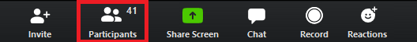

# Introductions
**Texts to have read:** the course description

**Writing to turn in:**

* (at start of class) survey about other coursework, tech comforts and discomforts, etc
* (at end of class) letter to Ben about your habits, expectations, and goals as a composer of digital media

Even before we start, I invite you to take a minute and adjust the way your name displays in Zoom. Pitt requires that this default to <em>LastName,FirstName</em>, so we have to change it every time. But I want you to know that you can call me Ben, and that I use he/him pronouns. How would you like us to address you?

To make a change, just click the three dots that appear when you hover over your own face. (Note that you can also Hide Self View if you find that distracting.)

And while we're talking Zoom, you probably noticed that this is being recorded, and it'll show up on the Panopto tab in Canvas later today: that's primarily for the benefit of folks working asynchronously, but I hope it's also helpful even for people who are here, to be able to come back and review when you want to. To make this a safe choice, I ask that you (1) please don't share the videos beyond our class community; and (2) please let me know (e.g. by private chat) if you want to pause the recording for a candid off-the-record discussion. Some things will automatically <strong>not</strong> be part of the Panopto recording: breakout groups, which we'll use a lot; the group chat; and the faces of anyone who's not speaking or who's turned their cameras off.

If you do need to have your camera off, I prefer that there be some profile image. It doesn't have to be a picture of you -- people have used their pets, or abstract images -- but it's more personal than the blank boxes, which is good for building classroom community.

## 1. Introduction to the course and to each other

I'd like to know more about you! Head on over to <a href="http://bit.ly/cdm2021survey">bit.ly/cdm2021survey</a> and fill in the first page or two. (I'll give you time to work on the rest later, so **please leave the tab open for now.** And don't worry that it says 2021! I'm using the same questions as last year.)

When you've done that (or after about 5 minutes), please:

1. Make a short list of sounds that you associate with being "at home" (whatever that means to you today). Alternately: instead list sounds you associate with being "at school."
2. Write down at least one digital tool, or app, or website, that more people should know about.
3. When you've finished both of these tasks, click the green check button. (You'll find it on the menu bar under "Reactions.")

Note that you also have a list of Participants that'll bring up a list of everyone in the call, either in a new window (if Zoom is fullscreen) or to the right of everyone's faces;  Raise Hand button should be at the bottom left of that new window.

EXT: If you've done all that and you're waiting, pick one item on each list to write more about. Why these?

NB: I'll often use that EXT notation to signal an "extension activity," i.e. something you can do if you finish before the rest of the class, or if you just want to dig a little deeper. (There is always more to do.)

  
And when you're all ready...

  <em>Yup, it's introduction time!</em> Let's share these around the Zoom, as a way of meeting and greeting each other – and picking up some digital suggestions along the way. (Later, I'll ask you to post your recommendations as part of your first contribution to our class discussion forum.) Just one item from each list should do the trick.

## 2. A letter from Ben
It's part of the [syllabus]({{site.github_url}}/uploads).

## 3. Write a short letter back to Ben.
Please do this on the **third page of that same survey**, which you should still have open. If you've misread the instructions and already turned it in, email's a good fallback option.

Some considerations you might address include:

* What were your expectations for the course coming in? What were your goals? If they’ve changed at all after reading / hearing my letter, how?
* What, if anything, surprised you in my letter? Why? If you have any questions or concerns, please ask them!
* If anything in my letter particularly excites you, or helps you, please let me know that, too!
* What are your habits as a reader, of digital media or otherwise? Do you like to read? What do you like to read? Where do you do your reading? When? Has this changed, that you’re aware of?
* What are your habits as a writer (again, digital or otherwise)? What assets do you bring to the class that might help you or your classmates? What challenges do you think you’ll face?
* Consider telling a story or two about a particular experience with reading or writing, multimodal or otherwise, that helps clarify something you want me to understand. Use concrete details to make the story present to me; help me get to know this memory through your eyes.

Don’t feel that you have to answer every single one of these questions, and especially don’t feel you have to answer them in order. Similarly, don’t feel your letter must be limited to only those questions covered in the bullet points.

* EXT: If you finish early, think about making the letter multimodal. e.g. What images would you want to add? How might you arrange the images and text?
* EXT: If you finish that, too, consider audience: how might you want to change this letter for posting an introduction to yourself on the course's (public) website, vs. just sending to me?
* EXT: Finally, if you're still waiting for others, go ahead and read the rest of this page, starting from the URL in the syllabus: {{site.github_url}}. Then you can start the homework until we're ready as a class to sync up again.

## 4. Homework preview
One of the tasks for homework will be to post a brief introduction to yourself on our course discussion forum. We'll be using GitHub Issues for this purpose; I'll <a href="{{site.github.issues_url}}/1">demo quickly</a>, in case you haven't seen this before.

But first, an important consideration: <em>what web handle do you want to use for yourself in this course?</em> Will it be the same one you generally use for social media? Will you use your real name, or something more anonymous? There are pros and cons with each choice. We can discuss, if you'd like!

# Homework

**Before you leave**, or by next class if you're participating asynchronously, please submit the survey and letter, if you haven't yet

**For next time**:

1. Some introductory info-sharing:
  * **Log into Canvas and complete the [two short syllabus-related modules]({{canvas_url}}/modules)**: one on [self- and community-care]({{canvas_url}}/pages/accessing-resources), and one on the [grading contract]({{canvas_url}}/pages/contract-what). There's a forum at the end where you can sign on to this grading format, ask questions about it, or even propose changes. (I want you to succeed: the contract is generally speaking a *collective* bargaining agreement, but if you need accommodations more personal to you, please email or speak to me one-on-one about how we can make it work!)
  * Afterward, if you haven't yet, **read** the [full syllabus]({{site.github_url}}/uploads), which you should have received by email. (If you don't have it, you can download a copy on the Uploads page of this site.) It includes the info from Canvas, plus a statement on course outcomes and my commitments to you.
  * **Respond** to the [Tech Comfort Survey](http://bit.ly/cdm2021survey) if you haven't done so in class
2. Some (somewhat) more extended writing
  * **Join** [GitHub](https://github.com/) if you haven't yet,
  * **and post** a brief introduction to yourself on the <a href="{{site.github.issues_url}}/1">issue queue</a>.
    - Feel free to excerpt from the letter you wrote me today, or to adapt it for the wider audience, if you want; you should have received a copy of your post at whichever email address you used on the form.
    -  If you'd like, feel free to include a link to that digital tool / app / website you wrote down at the start of class!
3. Finally, you'll need some software for next class:
  * **Download and install** a plain text editor with syntax highlighting; if you don't already have a preference, I recommend [Atom](https://atom.io).
    - NB: Microsoft Word is *not* good enough for this purpose. Word files are very much not plain text... as you can see if you replace the .docx with .zip and expand the result.
    - If you already use Notepad++ or SublimeText or something like that, that's fine. I may ask you to share your screen so we can look for similarities and differences. :1
  * **Download and install** the [GitHub Desktop application](https://desktop.github.com).
    - NB: If you super-prefer command-line git, you're welcome to use it, but we will be talking about the GH Desktop interface on Thursday.
